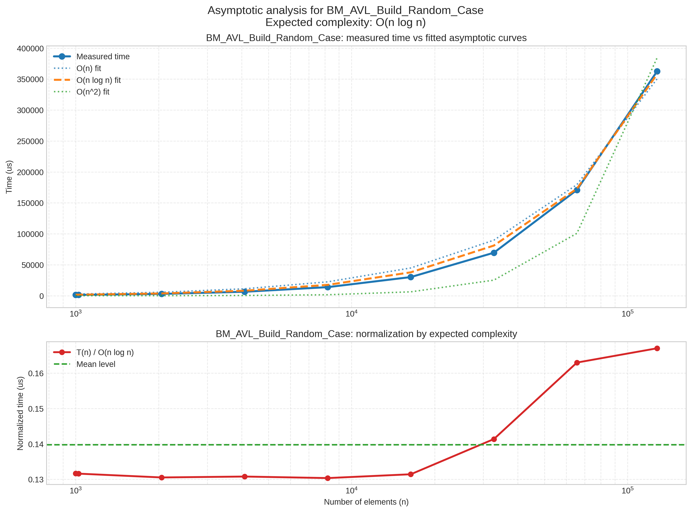
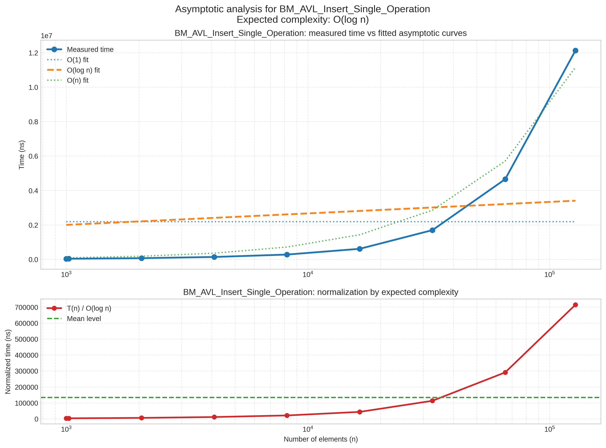
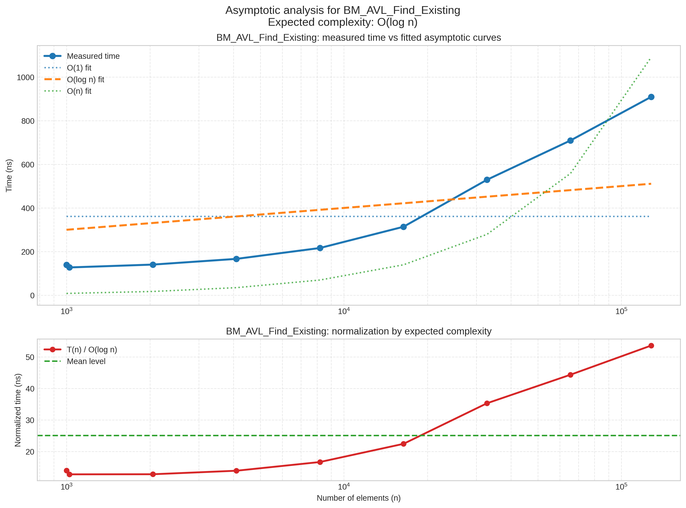
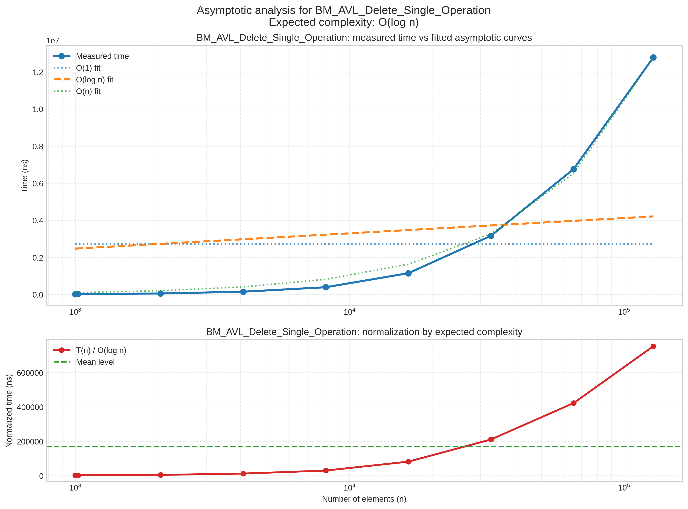
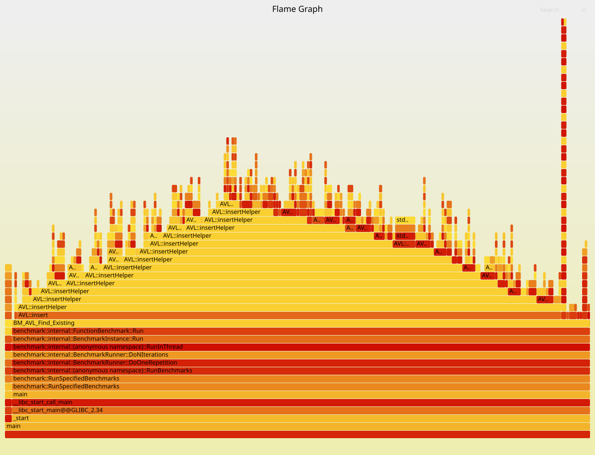

# Lab1: AVL Tree Benchmark Project

## О проекте

Этот проект посвящен реализации `AVL`-дерева на C++ и измерению производительности основных операций с помощью `Google Benchmark`.

В проекте:

- реализовано `AVL`-дерево с балансировкой;
- измеряется время выполнения операций `insert`, `remove` и `find`;
- сравнивается поведение построения дерева в разных сценариях;
- строятся графики по результатам бенчмарков;
- можно дополнительно построить `flamegraph` для профилирования.

Основная логика дерева находится в:

- `inc/AVL.h`
- `src/AVL.cpp`

Бенчмарки находятся в:

- `src/main.cpp`

## Что измеряется

Программа запускает набор benchmark-сценариев для:

- поиска существующего элемента;
- поиска листа;
- одиночной вставки;
- одиночного удаления;
- построения дерева в `best case`;
- построения дерева в `random case`;
- построения дерева в `worst case`.

## Требования

Для сборки и запуска понадобятся:

- `CMake` версии 3.14 или выше;
- компилятор с поддержкой `C++17`;
- доступ в интернет при первой конфигурации, потому что `Google Benchmark` загружается через `FetchContent`;
- `Python 3` для построения графиков;
- Python-библиотеки из скрипта визуализации:
  - `matplotlib`
  - `numpy`

При необходимости их можно установить так:

```bash
pip install matplotlib numpy
```

## Сборка проекта

Из корня проекта выполните:

```bash
cmake -S . -B build
cmake --build build
```

После сборки основной исполняемый файл появится здесь:

```bash
./build/main
```

## Запуск бенчмарков

Сам бинарник `main` запускает именно бенчмарки, а не обычную консольную программу.

Простой запуск:

```bash
./build/main
```

Если нужно сохранить результаты в JSON:

```bash
./build/main --benchmark_out=plots/results.json --benchmark_out_format=json
```

Также можно использовать CMake-цель:

```bash
cmake --build build --target run_simple
```

Эта цель тоже запускает бенчмарки и сохраняет результаты в `plots/results.json`.

## Построение графиков

После получения файла `plots/results.json` можно построить графики через Python-скрипт:

```bash
python3 pyscript/graphics.py plots/results.json plots
```

В результате в каталоге `plots/` появятся изображения `.png` с графиками для разных операций.

Примеры файлов:

- `plots/bm_avl_build_random_case_asymptotic_linear.png`
- `plots/bm_avl_insert_single_operation_asymptotic_linear.png`
- `plots/bm_avl_find_existing_asymptotic_linear.png`
- `plots/bm_avl_delete_single_operation_asymptotic_linear.png`

## Как посмотреть графики

Самый простой способ:

- открыть папку `plots/` в файловом менеджере;
- открыть нужные `.png` файлы любым просмотрщиком изображений.

Если графики уже были сгенерированы ранее, их можно посмотреть сразу в каталоге `plots/`.

## Примеры полученных графиков

Ниже приведены примеры графиков, которые строятся по результатам бенчмарков.

### Построение дерева: random case

Этот график показывает время построения `AVL`-дерева при вставке элементов в случайном порядке. Верхняя часть отображает реальные замеры и аппроксимацию ожидаемой сложности, нижняя часть показывает нормализованное время.



### Одиночная вставка

На этом графике измеряется время одной операции `insert` в уже подготовленное дерево. Для `AVL`-дерева ожидается логарифмический рост времени при увеличении числа элементов.



### Поиск существующего элемента

Этот график показывает поведение операции `find` для существующих ключей. По нему удобно смотреть, насколько результаты согласуются с ожидаемой сложностью `O(log n)`.



### Одиночное удаление

Здесь показано время одной операции `remove` из дерева после предварительного заполнения. Это позволяет оценить практическое поведение удаления на разных размерах входных данных.



## Дополнительно: flamegraph

В проекте есть CMake-цель для построения flamegraph:

```bash
cmake --build build --target flamegraph
```

Для этого дополнительно нужны:

- `perf`;
- утилиты `FlameGraph`;
- в `CMakeLists.txt` ожидается каталог:

```bash
/home/artem/FlameGraph
```

Результат сохраняется в:

```bash
plots/flamegraph.svg
```

Ниже приведен пример flamegraph, построенного для одного из benchmark-сценариев. Он показывает, в каких функциях программа проводит больше всего времени во время выполнения.



## Полезные файлы проекта

- `CMakeLists.txt` — сборка проекта и кастомные цели;
- `src/main.cpp` — benchmark-сценарии;
- `src/AVL.cpp` — реализация дерева;
- `inc/AVL.h` — интерфейс дерева;
- `pyscript/graphics.py` — построение графиков;
- `plots/results.json` — результаты benchmark-запуска;
- `plots/*.png` — изображения графиков.
- `exampleplots/` — примеры графиков и flamegraph для README.

## Быстрый сценарий запуска

Если нужно просто собрать проект, получить результаты и построить графики:

```bash
cmake -S . -B build
cmake --build build
./build/main --benchmark_out=plots/results.json --benchmark_out_format=json
python3 pyscript/graphics.py plots/results.json plots
```

## Примечание

В проекте есть дополнительные CMake-цели для анализа и автоматизации, но основной рабочий путь сейчас такой:

1. собрать проект;
2. запустить `main` с сохранением результатов в `plots/results.json`;
3. построить графики через `pyscript/graphics.py`.
